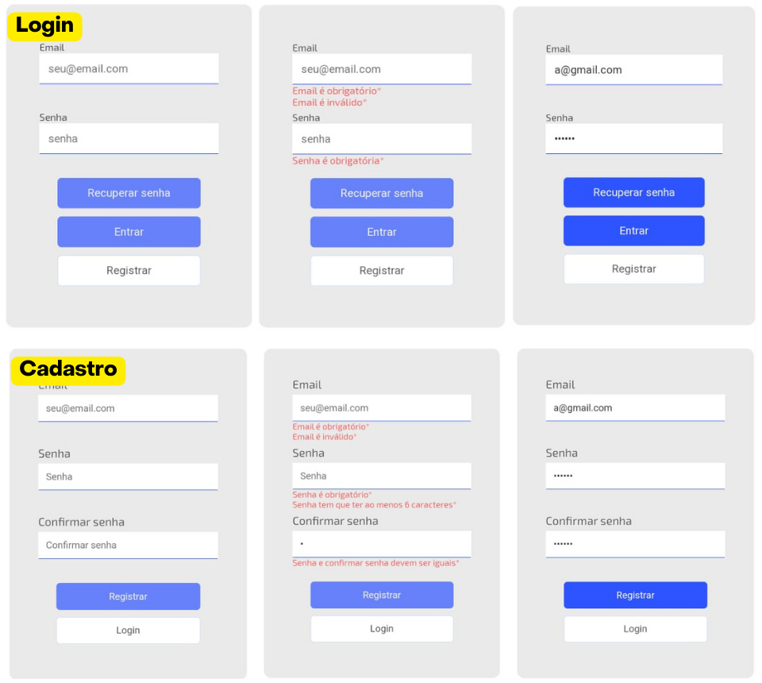

# Projeto de Portfólio: Tela de Login

Este projeto apresenta uma tela de login totalmente responsiva, desenvolvida em boas práticas de desenvolvimento front-end, utilizando HTML, SCSS e JavaScript.

### Funcionalidades Principais

- Validação de Formulário: Validação em tempo real dos campos de e-mail e senha, com exibição de mensagens de erro personalizadas.
- Integração com Firebase: Implementação de autenticação de usuários utilizando o Firebase, permitindo login, registro e recuperação de senha.
- Design Responsivo: Layout responsivo, adaptando-se perfeitamente a diferentes tamanhos de tela, garantindo uma experiência de usuário consistente em dispositivos móveis e desktops.
- Persistência de Sessão: Configuração de persistência de sessão no Firebase, mantendo o usuário logado entre sessões.

### Tecnologias Utilizadas

- HTML5: Estrutura semântica do projeto.
- SCSS: Estilização avançada e reaproveitamento de código através de mixins e variáveis.
- JavaScript: Lógica de validação de formulário, controle de erros e integração com o Firebase.
- Firebase: Autenticação de usuários e gerenciamento de sessões.

### Como Usar

1. Clone o repositório:

```bash
git clone https://github.com/Edio-Goncalves/tela-login-firebase
```

2. Navegue até o diretório do projeto:

```bash
tela-login-firebase
```

3. Execute o projeto: Abra o arquivo `index.html` no seu navegador.

### Capturas de Tela


